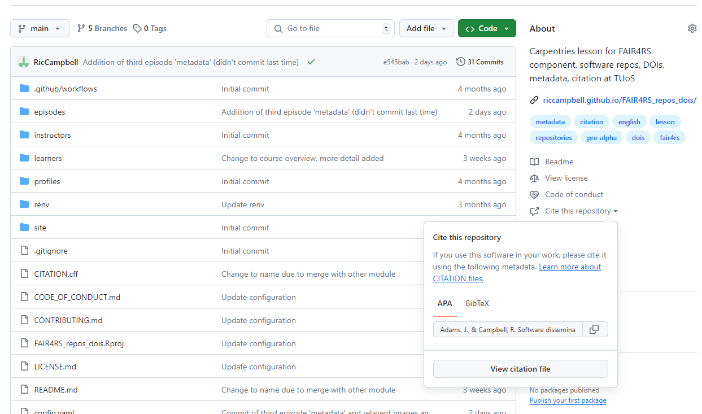

:::::::::::::::::::::::::::::::::::::: questions 

- I can cite/people can cite my code?
- What do you want people to access if it's cited?
- How do I cite code?

::::::::::::::::::::::::::::::::::::::::::::::::

::::::::::::::::::::::::::::::::::::: objectives

- Understand the importance of citing all work
- Be able to think about what should be cited
- Know how to cite code, and how others can cite you

::::::::::::::::::::::::::::::::::::::::::::::::


## Introduction


If we go back to the first thing that was stated in this module,

*The code that you write is important. No matter the size, style, or language, it is an integral aspect of the research that it is part of, or indeed, sometimes it is the main output of the research project.*,

This also applies to code that other people write. That’s why it’s important to know that you can (and should) cite other people’s code when you use it, and also how to enable other people to cite yours.

## DORA, funders, and the (hidden) REF

<!--- ask about any other elements, the importance of other outputs, not just papers --->

[DORA](https://sfdora.org/), The Declaration on Research Assessment, sets out to improve the ways in which the outputs of scholarly research are evaluated, essentially moving away from a focus on the impact factor of journals that you publish in. The University of Sheffield is a signatory of this declaration. DORA prompts institutions and the sector as a whole to consider [different ways of evaluating research quality](https://sfdora.org/read/), including assessing the quality of all research outputs (e.g. datasets, code) as well as published journal articles, and encouraging recognition of all authors’ contributions.

We’re also seeing a continued movement from funders to make open and available all aspects of research projects as the importance and cost of all elements are more fully recognised. For instance, we’ve seen this with data, with a lot of funders requiring (where suitable) this to be made openly accessible, and we’re also increasingly seeing it with code. Making things open and reusing existing work are both important goals, and ensuring people get the recognition they deserve from their work is essential (and also in most cases a legal necessity - see licence section of this module, or software Terms and Conditions e.g. [SAS](https://www.sas.com/en_gb/legal/editorial-guidelines.html)).

There’s also been some movement with the REF as well, with more types of outputs being considered eligible to be returned, and if we think about impact case studies, a useful piece of software could easily have a substantial impact. There are also movements like the [Hidden REF](https://hidden-ref.org/the-5-percent-manifesto/), whose objective is to gain recognition for all people who contribute to research, and are also wanting institutions to pledge to making 5% of their REF returns non-traditional research outputs (i.e. anything that’s not a journal paper or book).

These are also all good reasons not to simply cite the associated paper for a piece of software (if there even is one), but to cite the software itself - and to make it easy for others to cite your own code.


## Citation and CITATION.cff files

Citation of software is of course different to that of a standard journal article. Normally there is one version of an article and nothing that can really ‘break’ with them; this is not true of software. Also, a paper tends to have all the information you need to cite it correctly quite clearly there for you - again, this often isn’t the case for software.

::::::::::::::::::::::::::::::::challenge 

Think what people might need to know from a citation to be able to reproduce a piece of research. (I.e., to make sure they're using the same piece of software used in the original study?)

:::::::::::::::::::::::::::::::::::::::::

Some of the main things to know about the software used that would be integral to being able to reproduce the outputs would be:

 - Title
 - Authors
 - Version used
 - Where to find the software
 - How to access the code (if different to the above, and available)
 
The first two, while it’s clear that they should be part of a citation, might not immediately seem relevant when thinking about reproducibility, but if you think that they can sometimes act as a kind of ‘primary key’ to help people know they’re working with the right software (see the last episode and its discussion of naming things).

The bottom three you can see would be needed in order to be certain you can reproduce the work as best as possible. We know that many changes can happen between versions, some big changes, some small changes that could have knock-on effects to how everything works. Of course, where to find the software goes back to our first episode, and having a solid pointer to the code can be solved by getting a DOI for your work (you should of course not mint a DOI for other people’s work, and you might just have to cite the best link available).

<code>CITATION.cff</code> files are designed to pull together everything you or others need in one place. Similar to README, or LICENCE files, they are top level files that contain in a standardised fashion all the information required.

This is an example of a <code>CITATION.cff</code> file (the one for this module):

<code>
```
This CITATION.cff file was generated with cffinit.
Visit https://bit.ly/cffinit to generate yours today!

cff-version: 1.2.0
title: 'Software dissemination and impact'
message: >-
  If you use this software, please cite it using the
  metadata from this file.
type: software
authors:
  - given-names: 'Jenni'
    family-names: 'Adams'
    email: 'j.adams@sheffield.ac.uk'
    affiliation: 'University of Sheffield'
    orcid: 'https://orcid.org/0000-0003-2420-0763'
  - given-names: 'Ric'
    family-names: 'Campbell'
    email: 'r.j.campbell@sheffield.ac.uk'
    affiliation: 'University of Sheffield'
    orcid: 'https://orcid.org/0000-0002-0975-9270'
repository-code: 'https://github.com/RicCampbell/FAIR4RS_repos_dois'
url: 'https://github.com/RicCampbell/FAIR4RS_repos_dois'
abstract: >-
  While putting your software online certainly helps it satisfy the FAIR principles, simply doing so might not be enough for other researchers to actually find and utilise what you’ve put out there.

  It’s important to know the benefits and issues with where you store and publish your data, and to make the most of the tools these platforms provide, such as Digital Object Identifiers (DOIs). It’s also important to know best practice for how to increase the visibility and citability of your work in cases where your chosen platform lacks these features.

  This course will introduce and explore worked examples of elements that you should consider when publishing your software, which will help you easily reference your work, and also help make it more findable and reusable by others.

keywords:
  - carpentries
  - fair4rs
  - university of sheffield
  - repositories
  - dois
  - metadata
  - citation
license: CC-BY-4.0
```
</code>

As you can see, this has all the relevant metadata needed for full citation, and you can see where it was created. This has also been updated manually as well when things have changed, but there are lots of places online where you can see the fields needed and the style they should be in if you have a quick search.

If this is inside a GitHub repo, then on the right hand side, you will be able to get the citation text, or download one to be imported into a reference manager, via a BibTeX file.

{alt="A screenshot showing the options shown when clicking on the 'Cite this repository' in GitHub."}

So this is great for people citing your work and for getting the correct information to cite other people's work.

## Not all citations are created equal

GitHub is not the only platform to make use of <code>CITATION.cff</code> files; however, not every platform or repository uses them either. As previously mentioned, you can link your GitHub repos to ORDA, the University of Sheffield repository, and ORDA has an easy way of creating citations as well:

{alt="A screenshot showing the a citiation created by ORDA."}

However, the two citations that we’ve just seen for the same output are not the same. The issue comes with the fact that Figshare (which the University of Sheffield repository,  ORDA, is an instance of), does not look in the <code>CITATION.cff</code> file, but instead creates one from the metadata that is entered for the deposit. In this example, the author list is different as I’ve entered all authors into the <code>CITATION.cff</code> file, but have not edited this in ORDA. It’s easy to add these, but it means repetition of work. While this isn’t ideal, it’s important to try to get everything the same where possible. You don’t know where your work may end up once it’s been made open, so controlling what you can to start with really improves chances of the provenance being kept with it, and the ability of people to find the original repository. The <code>CITATION.cff</code> file should also always be kept with your work if it does get shared onwards, and helps to this end as well.

GitHub citation:

<code> Adams, J., & Campbell, R. Software dissemination and impact [Computer software]. https://github.com/RicCampbell/FAIR4RS_repos_dois </code>

ORDA citation;

<code> Campbell, R. (2024). *FAIR4RS_repos_dois* (Version 0). The University of Sheffield. </code>

## Extending your CITATION.cff file

There are also a lot of standardised fields that you can add to your <Code>CITATION.cff</code> file, other than the ones we have already seen. You can link to a related journal article if there is one, or you could cite a dataset that is contained in your GitHub repo. For more information about these extensions, GitHub provides an easy-to-follow [help page](https://docs.github.com/en/repositories/managing-your-repositorys-settings-and-features/customizing-your-repository/about-citation-files) on the subject.

:::::::::::::::::::::::::::::::::::: keypoints
 - Citation is important to ensure that the correct recognition and credit is assigned to all work
 - Citation of software differs from that of articles, but is needed to aid the reproducibility of work
 - <code>CITATION.cff</code> files should contain all the necessary metadata and help create citations for use.
 - You may need to complete the relevant fields in multiple places to ensure correct citation in all cases.
::::::::::::::::::::::::::::::::::::::::::::::


