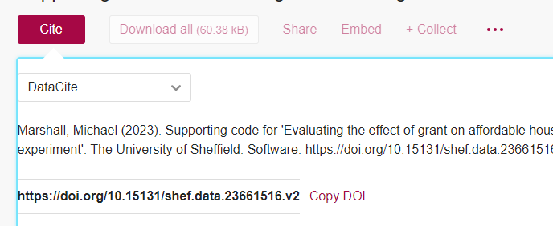

:::::::::::::::::::::::::::::::::::::: questions 

- What is a DOI?
- What good is a DOI (compared to, say, a URL)?
- How do I get a DOI?

::::::::::::::::::::::::::::::::::::::::::::::::

::::::::::::::::::::::::::::::::::::: objectives

- Understand what a DOI is
- Understand how they differ from other ways to link to your work
- Understand how to create and source a DOI for your work

::::::::::::::::::::::::::::::::::::::::::::::::

## Introduction

The code that you write is important. No matter the size, style, or language, it is an integral aspect of the research that it is part of, or indeed, sometimes it is the main output of the research project.

Historically ‘research outputs’ have been focused on papers, and while this is still mostly true, there has been a change in recent years to give better acknowledgement to other research outputs, such as code. There has also been a shift (which we are continuing to see) that funders are requiring other outputs from projects to be made available. While this is mostly focused on the data that has been collected or used, in certain fields code is also part of this. You may also come across conferences or awards that require code to be available (and open) in order to submit or be considered. There’s also been a rich history of code being made free and available to others.

Regardless of the reason you want to disseminate your code, there are some ways you can make this easier for both yourself and anyone who wishes to use your code - these include DOIs, using repositories, providing metadata, and knowing how to cite yourself.

## What is a DOI?

A DOI is a type of PID. A PID is a Persistent Identifier - a reference that will continue to identify the same object, person or institution over time. A DOI is a Digital Object Identifier - a PID that refers specifically to a digital object such as an online article, dataset or archived piece of software. Each individual DOI is linked to a specific digital object and (should) always direct to that object, regardless of potential changes to its location or metadata. The most common use of DOIs is for journal articles. A single article should have a single DOI, but they can also be used for databases or software/code.

::::::::::::::::::::::::::::::::::::::: callout

# Example DOI

This is what a DOI looks like:  [10.1016/j.ascom.2020.100427](https://doi.org/10.1016/j.ascom.2020.100427)

:::::::::::::::::::::::::::::::::::::::::::::::

You’ve probably seen these many times before because, like this one, they are used for journal articles. Interestingly, the article the above DOI links to is about a tool that has been created, is freely available, and has a licence applied to it, but it provides no link to the [code/software itself](https://github.com/astrom-tom/SPARTAN).

## Isn't that just a link/URL?

No. The internet as a whole is much more fragile than most people think. There area myriad of different ways that things can break or cease to exist. While there are, of course, some old webpages that are still up for no apparent reason, and multiple archives and projects that try to capture parts of the internet ([Wayback Machine](https://web.archive.org/), [Software Heritage](https://www.softwareheritage.org/)), these are by no means complete.

But thinking of your own code, if it’s on a webpage (maybe your own), hosting isn’t free: are you planning on keeping this webpage for a long time? Can you guarantee it will never be moved from that page/URL, and do you know if other people are using that link?

::::::::::::::::::::::::::::::::::::::: callout

A DOI essentially makes it someone else's job to ensure that the link resolves to the right digital object.

:::::::::::::::::::::::::::::::::::::::::::::::

Only registered organisations can create DOI’s. To be able to mint a DOI, an organisation must meet the International DOI Foundations standards and pay to become a member, meaning that they must have the ability to ensure the DOIs are maintained.

DOIs are also designed to be short and human-readable, again unlike most URLs, whereas shortened URLs are not persistent.

## DOI and version control

Version control is of course very important around code (see the Version Control part of the FAIR^2^4RS training), and you shouldn’t create more than one DOI for a single digital object -  however you can nevertheless version with DOIs:

::::::::::::::::::::::::::::::::::::::: callout
# DOIs with multiple versions

[10.15131/shef.data.22633528**.v2**](https://doi.org/10.15131/shef.data.22633528.v2)

:::::::::::::::::::::::::::::::::::::::::::::::

That part at the end indicates which version the DOI will resolve to. If you have written some code for a research project, and the current version is the one that was used, but you are still developing it, referencing that version in any paper or outputs will allow people to see exactly what the code looked like at the time the research was conducted.

It’s important to note that if no version suffix is included in the DOI link, it will resolve to the most recent version of the object. This is sometimes exactly what is wanted and sometimes not, so it’s good to think about this when using a DOI.

## How do I get a DOI?

To get a DOI for code, the best place to use is a repository. It’s important to note that (currently) GitHub does not mint DOIs. Some examples of repositories that do are [Zenodo](https://about.zenodo.org) and the University's institutional repository, [ORDA](https://orda.shef.ac.uk).

When you make a deposit in a repository that does mint DOIs, there should be nothing extra you have to do, when it has been published, there will be a DOI that you can use to cite and refer to your work.

{alt="A screenshot of a the DOI on a Zenodo deposit"}

{alt="A screenshot of a the DOI on a ORDA deposit"}

:::::::::::::::::::::::::::::::::::: keypoints
 - DOIs are persistent identifiers that should always point to your code.
 - They should be maintained by the minting organisation, making them stronger than a URL.
 - DOIs can handle multiple versions of the same object.
 - Some repositories mint DOIs for deposits.
::::::::::::::::::::::::::::::::::::::::::::::
