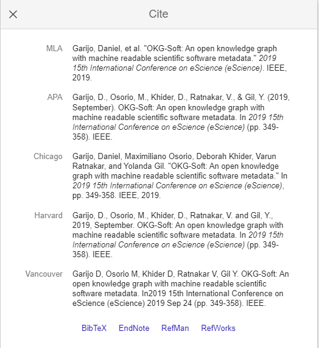

:::::::::::::::::::::::::::::::::::::: questions 

- What is metadata and why is it important?
- What is best practice around metadata?
- What does good metadata look like?

::::::::::::::::::::::::::::::::::::::::::::::::

::::::::::::::::::::::::::::::::::::: objectives

- Understand the role and need for metadata for your outputs
- Know what best practice is and be able to apply it
- Learn from examples of good metadata

::::::::::::::::::::::::::::::::::::::::::::::::

## Introduction

Simply put, metadata is data about data (hence meta). This might not be that helpful a description however, but is necessary as it holds true across all types of metadata. If we continue with the idea of depositing your code in a repository as we saw in the previous episode, however, it becomes much clearer. The metadata is the data that’s on the deposit ‘front’ page, so to speak. It is there to inform anyone who comes across the deposit what they have found without them having to dive too far into the actual data or code.

## Can you show me some good metadata?

Of course, however, it might be more interesting to look at some bad metadata, as it’s probably more effective in showing how important metadata can be.

{alt="A screenshot showing a deposit in ORDA with bad metadata"}

As you can see there, there’s some information about the deposit, but it’s probably not nearly enough for anyone to know what it really is, or if it’s useful to them. This code could be perfect for someone to use, or adapt, but they wouldn’t know without having to do a lot of work to figure this out. There is a link to the GitHub repository, but that’s probably not got any more information in it, and still, as we’ve seen, that wouldn’t enable someone to reference your work. (N.B. There’s no DOI on this deposit, as it’s just a draft - we wouldn’t really accept a deposit into ORDA that had so little information - another good reason to think about metadata, as ORDA isn’t an outlier in this regard).

But there is a README there, which asks the question:

## Is a README metadata?

It’s a good question, and one I’m sure people would argue over as they have different views on it. Technically, metadata is for finding software, while documentation, including READMEs, are for understanding it. However, the thing that actually matters is that you should probably have a README, and metadata, and other documentation as well. READMEs and other documentation (comments etc.) should be created early and updated as you go along, with potentially metadata being created later in the lifecycle. However, a good README may directly feed into your metadata. There’s no problem with copying and pasting elements; in fact it can be beneficial: it saves you time, and makes sure everything is consistent.

It might be worth thinking of metadata as the overarching information about your code. A README goes into more detail but covers the whole software/project, and comments etc are much more fine-grained documentation relating to the places in the code where they reside.

There is a [Documentation](https://github.com/Joe-Heffer-Shef/FAIR4RS-Documentation/tree/main) module on this FAIR^2^4RS course, which goes over all things documentation in more detail.

:::::::::::::::::::::::::::::::::::::::: challenge

What metadata do you think should be included in a deposit?

:::::::::::::::::::::::::::::::::::: hint

## Hint

Think about what you might want to see if you were reusing code (i.e. a package), or what you probably take for granted that you know about your code

:::::::::::::::::::::::::::::::::::::::::

:::::::::::::::::::::::::::::::: solution

## Solution

- Name (a good one)
- (Lay) summary
- A description of what it is
- What language is it in, and versions
- Provenance
- It's licence (see licence section)
- Any related material
- Dependencies
- File structure

:::::::::::::::::::::::::::::::::::::::::

::::::::::::::::::::::::::::::::::::::::::::

These might not even be everything depending on what you have created. You might want to have use cases, the target audience, key features, compatibility etc. The point is to have information that reduces the workload or thought that someone has to take on in order to know what it is they’re looking at, and if it’s useful to them.

None of these are world-changing ideas, but they do require some thought:

::::::::::::::::::::::::::::::: callout

*"There are only two hard things in Computer Science: cache invalidation and naming things."*

-- Phil Karlton

:::::::::::::::::::::::::::::::::::::::

You may have heard or seen this quote before, but it does stand true: naming things is hard. This principle is normally applied to variables, but it does carry over to other elements too. Creating a short, informative summary or description can be tricky, but doing that using no specialised vocabulary makes it harder, as does trying to include all the less tangible, or overarching, elements that you know about your work but others do not.

If we go back to the example of bad metadata that we saw earlier, there are actually two bits of information there that are helpful.

1. It's got the right type of item type selected, as it's down as 'software', which makes it easier for people to find and know immediately what it is.
2. It also mentions that it’s mostly to do with ‘wrangling of health data’. This is not much information, but it can be very easy to forget the most simple elements. If you’ve only ever worked with health data and written plenty of bits of code to help, you might not think to mention this very high-level piece of information.

## Machine-findable

It’s best when thinking about creating metadata that you think of human users. It’s also really good to think of yourself as one of these users, either yourself a few years ago, when you might have known less of the area and might not have known exactly what you were looking for, or yourself in a few years, when you’ve most likely forgotten everything about this code, why you made it, and what exactly it does.

However, you also get a bit more findability for free by creating metadata, as these fields are often used and standardised for machine readability as well.

## A good example

We've seen a bad example, but what would a good example look like?

{alt="A screenshot showing a deposit in ORDA with good metadata"}

:::::::::::::::::::::::::: Challenge

Can you pick out the good (and bad) elements of metadata in the above deposit?

:::::::::::::::::::::::::: Solution

- Author names
- Version number
- Date created
- Item type
- A clear name
- A clear description
- Licence
- Categories and keywords
- Related materials including a link to the relevant paper
- *Initialism in title (bad)*

::::::::::::::::::::::::::::::::::::

::::::::::::::::::::::::::::::::::::

There’s also the language that it is written in, both in the description and the keywords. The first three listed, names, version, and date, would all fall under what was previously referred to as provenance. As you can see, a lot of these are fields you probably have to complete when making a deposit to a repository, which makes it easier, but if you are taking a different route, these could be easy to miss out. It's also important that you keep these items up to date if they change. Do also take a bit of time to consider them - for example, it’s not good form to miss someone off an author list, and this applies to software author lists as well.

## Standards

As we’ve just seen, a repository, even a GitHub repository, has fields for some of this information and these will be implementing a standard, but if you are adding metadata that isn’t a standard GitHub/repository field, or creating your own metadata document, you might need to consider using a standard for your metadata. Some examples are schema.org’s [SoftwareApplication](https://schema.org/SoftwareApplication) type, and [CodeMeta](https://codemeta.github.io/). These help tools to work with your metadata by having a set standard. For example if you created it now, what would you call your author list field? Possibilities might be author_list, authorList, developer, developers, writer, creator, coders etc., are all these synonymous with each other for everyone? Would you complete those fields the same for your project? Implementing a standard stops this from happening, each field has a precise meaning and information on how to complete/read.

You’ll have come across standards before, of course, when you download citations of papers for your reference manager software:

{alt="A screenshot showing the standard citation options from Google Scholar"}

:::::::::::::::::::::::::::::::::::: keypoints
 - Metadata helps drive discovery of your software
 - It’s easy to not include key elements as these are ‘obvious’
 - Standardisation of metadata is useful to help tools use the metadata
::::::::::::::::::::::::::::::::::::::::::::::
