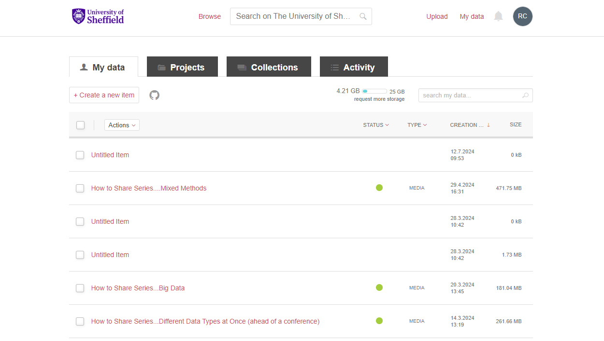
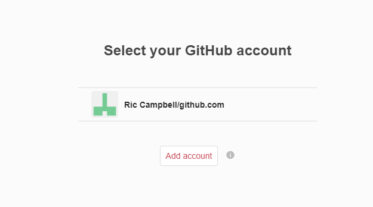

:::::::::::::::::::::::::::::::::::::: questions 

- What is a repository?
- How do I pick a repository?
- How do I link GitHub to ORDA?

::::::::::::::::::::::::::::::::::::::::::::::::

::::::::::::::::::::::::::::::::::::: objectives

- Understand what a repository is and does
- Feel comfortable selecting a suitable repository
- Know how to link a GitHub repository to ORDA (a DOI giving repository)

::::::::::::::::::::::::::::::::::::::::::::::::

## Introduction

Hosting large amounts of data, minting DOIs, creating a usable interface for code and ability to pull the code to other work setups all take a lot of time and effort. This is where repositories comes in. A repository will make space available to you to deposit your work. GitHub, as a whole, could be seen as a repository, although you create repositories yourself inside GitHub. It also does a lot more than just hold your data/code, and of course it's main function is version control.

In the last episode we saw some repositories [Zenodo](https://about.zenodo.org) and the University's institutional repository [ORDA](https://orda.shef.ac.uk), but there are many more out there. Most repositories, certainly around academia, tend to be fully open, so anyone can access what is deposited. 

It's important to remember this as you may not want, or be able to, make your code fully open to all (although we encourage you to where possible). However, there are repositories out there that have different levels of access. For example the [UK Data Service repository](https://ukdataservice.ac.uk/) has three levels of access, open, safeguarded (have to sign the End User Licence), and controlled (have to apply for access with criteria set by data provider), however, currently the UK Data Service does not hold code.

It's also worth noting that there are different types of repositories, some are purely for publications (such as the [White Rose Research Online repository](https://eprints.whiterose.ac.uk/), whereas others are data focused e.g. [Harvard Dataverse](https://dataverse.harvard.edu/)).

## Differences between repositories

As we've just seen not all repositories are created equal, some are not just repositories, others aren't technically repositories at all. This means you should put some thought into which repository you are going to use to deposit your code. 

::::::::::::::::::::::::::::::::::::::: callout

# What do you want from a repository

- Do you want your work to be fully open?
- What type of licence do you wish to apply to your work?
- Do you want a DOI?
- Do you need it to handle versioning?
- Do you need your work to be machine accessible? 

:::::::::::::::::::::::::::::::::::::::::::::::

You may also need to think about what licence you *can* apply as you may be limited by any third party software you are using. This is covered in more detail in the Software Licence section of this component.

Also the last point is probably more important around data rather than code.

## Picking a repositiry

As there are many different repositories out there, picking a suitable one for your code is an important task. You may know the repository that you wish to use already, or you may want to find a suitable subject specific repository. Both [re3data](http://re3data.org) and [FAIRsharing](http://fairsharing.org) hold a directory of repositories that can be browsed, searched, and filtered to help you find the most suitable repository for your needs.

{alt="A screenshot of the re3data page 'Browse by subjects' showing a wheel of all subjects available"}

Both have good meta data of each repository and helpful icons to quickly be able to answer some of the questions listed above.

Our own guidance is that you should look for a subject or data specific repository first, and if nothing is suitable or has the functionality required, then you should use ORDA (The University of Sheffield institutional repository).

:::::::::::::::::::::::::::::::::::::::: challenge

## Challenge 1: Would making my code a package be better?

If one of the main aims is to make the code you have written more (re-)useable by others, would it not be more suitable to create a package of the work, and what would be the pros and cons of doing so?

:::::::::::::::::::::::::::::::::::: hint

## Hint

Think about who 'owns' packages, how they are disseminated, and what we wanted to achieve with our code

:::::::::::::::::::::::::::::::::::::::::

:::::::::::::::::::::::::::::::: solution

## Solution

Maybe! But also probably not. The main issue is that they are different things really, or at least help and aid in different ways, but use a lot of the same vocabulary. While a package will most likely make it much easier for people to use you work (a simple install command), it often doesn't make it more citeable.

:::::::::::::::::::::::::::::::::::::::::

::::::::::::::::::::::::::::::::::::::::::::

For example, the main repository of Python packages the Python Package Index or [PyPI](http://pypi.org), holds over half a million projects, but does not mint a DOI for these projects. However, recently, all R packages on [CRAN](https://cran.r-project.org/) have been attributed a DOI. Now of course there's differences there in how packages are regulated but it's a good step forward and giving the creators of packages the recognition they deserve.

This is also the issue with using just GitHub, while it holds all your work, and enables people to access, read, use, and reuse your work, it also does not mint DOIs, as it's main function is to aid in version control and allow a team to work on the same project at once, it is not so concerned with the long term storage or archiving of work (unlike other repositories), and, while nothing has happened yet, it's worth remembering that GitHub is owned by Microsoft and could technically change at any time.

There is a lot more about packages in the FAIR^2^4RS component on this, including how to create and publish your own, including the automation of the publication.

The other issue with these being the same but different is that it is normally good practice to only put your work in one repository, however, it might be beneficial in this instance to have a package created for easy download, and your work in a repository that grants a DOI for better citation. (Note: it's very bad practice to gain more than one DOI for an output).

## Can this not all be automated and made simple?

There's certainly things you can do to help you manage this, but it depends on your definition of simple.

Within the ORDA, you can link your account and your GitHub account.

:::::::::::::::::::::::::::::::::::::::: challenge

## Go to ORDA and find the button that imports from GitHub

::::::::::::::::::::::::::::::::::::::::

:::::::::::::::::::::::::::::::: solution

## Solution

We'll go through this in a minute, but if you did actually find it, well done! Figshare (of which ORDA is an instance) does a lot right, but has some very strange decisions inside it as well.

:::::::::::::::::::::::::::::::::::::::

## ORDA

{alt="A screenshot of the ORDA landing page"}

This is the ORDA landing page, showing my login. All University of Sheffield staff and PGRs should have an account to access ORDA as it is associated with your staff/student profile (N.B. it is also deactivated with your profile, but can be re-activated for a period to allow a deposit or edit to be made).

From here if you go to the My data section in the top right, which will show something like this;

{alt="A screenshot of the 'My data' page in ORDA"}

You might be able to see it now, but it's still not clear how useful that button is. Next to the '+ Create a new item' button is a grey out Octocat, which hovering over will fill in the colour and provide the helpful words 'Import from GitHub'. Clicking on that will give you this popup;

{alt="A screenshot of the popup to link a GitHub account to ORDA, found in ORDA."}

And from this you can link your account, and pull in a repository directly to ORDA. You can see from the image below with the link it simply allows you to select which repo you want to pull across.

{alt="A screenshot showing how your repos are displayed to pull across in ORDA"

There's a few other bits of interest in this image as well. First you can see that if a GitHub repo has been imported by another user if doesn't let you create another deposit for it (remember this would mint another DOI for the same output), and this is across all instances of Figshare, for example that one is in the main Figshare.com instance. There is also a simple option that you can see there that allows automated updates of your GitHub repositories to be pulled into ORDA, the slider between the repo name and last modified date.

However that automation is reliant of the use of a GitHub Action, which might not be the best approach for yourself ([guidance on the Action](https://github.com/figshare/github-upload-action)).

Alternatively you could use Figshare's API to automate the creation of a new version. There's a much more detailed description and example of how to do this in the Packages component of this course.

As mentioned above, if you are thinking of having both a package in a repository, and depositing somewhere else to get a DOI, this is probably something you should certainly consider to ensure that there are not different versions of your work in different places.

## Zenodo

Of course these are not the only places, similar in practice you can deposit a GitHub repo in the Zenodo repository, which GitHub have written [guidance](https://docs.github.com/en/repositories/archiving-a-github-repository/referencing-and-citing-content) on.

:::::::::::::::::::::::::::::::::::: keypoints
 - There are numerous repositories around and you should consider what you want from one
 - Some are better than others at certain elements
 - GitHub doesn't mint DOI's but you can link repos to a repository that does
::::::::::::::::::::::::::::::::::::::::::::::
